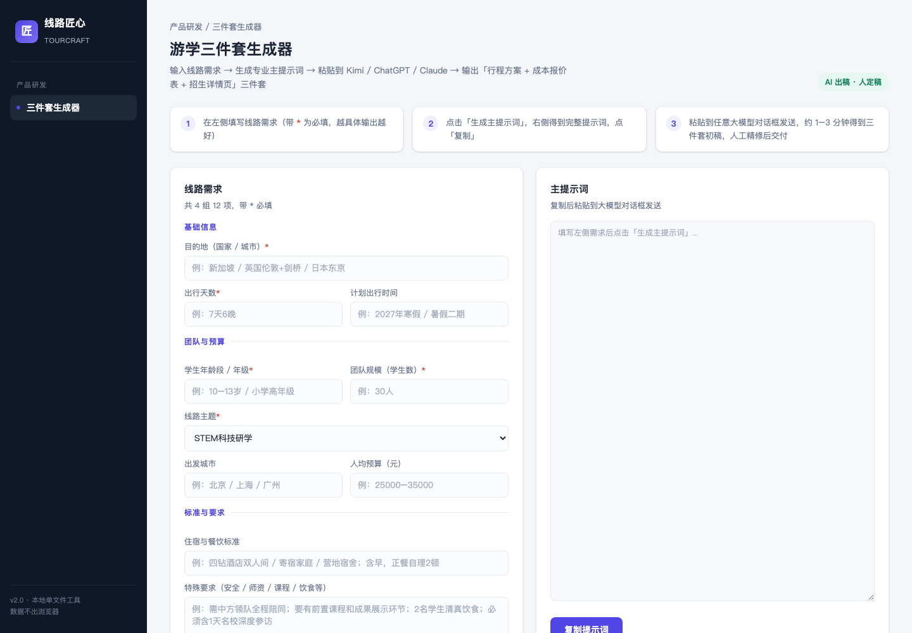

# 线路匠心 TourCraft

游学线路「三件套」AI 生成器 —— 一个本地单文件工具，把线路需求变成专业主提示词，配合任意大模型（Kimi / ChatGPT / Claude）一次产出：

- **A. 行程方案**（逐日安排 + 教育目标 + 师资配比 + 安全预案）
- **B. 成本报价表**（分类目估算区间 + 毛利率定价建议 + 【需人工核实】标注）
- **C. 招生详情页初稿**（家长视角文案，广告法合规）

工作流理念：**AI 负责 90% 共性劳动，定制师负责 10% 经验判断。** 所有价格和资源信息 AI 只给参考区间，交付前必须人工核实实时价格。

界面支持 **中文 / English / Français / Español / Deutsch / Svenska** 六种语言切换（右上角），生成的提示词语言随界面语言；可用 `?lang=fr` 等链接参数直接分享指定语言版本。

## 使用方式

**在线使用**：打开 <https://deliahuang621-png.github.io/tourcraft/> 即可，无需安装。

**本地使用**：下载 `index.html`，双击用浏览器打开。单文件、零依赖、数据不出浏览器。

## 适合谁

- 游学 / 研学机构的产品与定制师：快速出线路初稿和报价框架
- 独立教育顾问：一个人也能做出机构级产品文档
- 大模型玩家：参考其中的主提示词结构（角色 / 需求 / 分件要求 / 输出纪律）

## 参与共建

欢迎任何形式的贡献，不需要邀请：

1. **提 Issue**：线路模板建议、提示词改进、Bug 反馈
2. **提 Pull Request**：直接改代码或提示词模板
3. 可以贡献的方向举例：
   - 更多线路主题模板（营地、插班、亲子等细分场景）
   - 报价表类目细化（按目的地国家的成本结构差异）
   - 输出语言版本（英文详情页等）
   - 界面与交互改进

改动保持单文件、零依赖原则（不引入框架和构建步骤），让更多人打开就能用。

## 许可

[MIT License](LICENSE) —— 可自由使用、修改、商用，保留版权声明即可。
